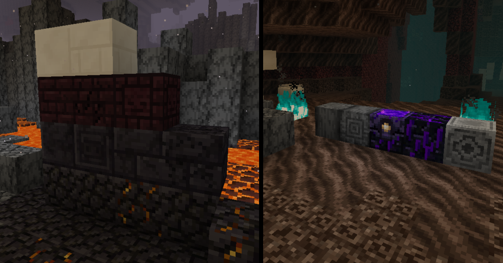

# Developer Art+
Developer Art+ is a Minecraft resource pack for those who prefer the older style of Minecraft textures. 

<b>(this pack must be used over top of the "Programmer Art" pack if you wish to use it in versions after 1.13.2)

(if you are using the Bedrock Edition, you need to have the "Classic Textures" pack applied below this pack)</b>

 
Beginning in the 1.13 and later updates, Mojang has hired a new texture artist for Minecraft, this has resulted in the style of the Minecraft textures completely changing.

In the 1.14 and future updates, they have added a tab in the resource pack menu to revert any pre-1.14 textures to their originals, however, Mojang has stated that future textures will not be supported with the original style, this resource pack aims to change that, and in this pack, any textures created which do not fit with the original style will be changed so that they do.

  
More Information

  
    - This pack works in versions 1.14 and beyond (including snapshot support),

    - I will be updating this pack as updates, snapshots, and pre-releases come out,

    - I will also be taking comments and suggestions into consideration as I know I am not the authority on what defines the original style.

<b>(if you like this project, a star would be much appreciated :D, and if you know anyone that might like it, please share it with them!)</b>

 

  
SPECIFIC CHANGES IN THIS PACK

  
    - Pre-snapshot hoglin texture

    - Updated plank texture on beehive

    - Ingot slot in smithing table matches ingot texture

    - Updated music disks

    - Added chain block

    - Updated quartz bricks and cracked nether bricks

    - Updated blackstone blocks

    - Updated warped fungus on a stick

    - Added lodestone block

    - Updated strider saddle

    - Respawn anchor matches crying obsidian and glowstone

    - Nether gold ore matches netherrack

    - Soul particles match original soul sand

    - Crying obsidian compromises new and original textures

    - Zombified piglin matches original zombie pigman

    - Piglins match old style

    - Piglin helmets match regular helmets

    - Improved shield indicator

    - Compromising netherrack texture

    - Minor adjustments to Nether wood doors

    - Nylium sides match netherrack

    - Nether planks match original planks

    - Minor adjustments nether stems

    - Nether stem tops match log tops

    - Updated soul torch

    - Soul lantern matches lantern

    - Soul soil matches soul sand

    - Removed blue tint from crimson roots

    - Removed blue tint from basalt

    - Updated new signs

    - Updated netherite armour

    - Updated netherite ingot

    - Minor adjustments to netherite scrap

    - Unified bee hive hue

    - Unified bee nest hue

    - Updated honey bottle with original style

    - Removed blue hue from bee stinger

    - Updated snowy grass block side

    - Updated podzel side

    - Updated mycelium side

    - Leather horse armour model and item texture matches that of the original

    - Brown mooshroom matches the style of the original red mooshroom

    - Status effect icons updated

    - Fox uses original colouring style

    - Wandering Trader uses original villager head and skintone

    - Chest minecart, furnace minecart, hopper minecart, TNT minecart, and command block minecart texture updated with original style

    - Compost texture uses the default style

    - Composter hue unified

    - Campfire flame matches regular fire

    - Campfire base uses log texture

    - Campfire coals are black rather than blue

    - Campfire smoke particles use original smoke particle style

    - Updated horse armour textures to match equipped horse armour

    - Villager heads and body match that of the original design

    - Ocelot pelt colour on jungle villagers matches that of the original ocelot texture

    - Plains villager coat uses original texture

    - Swamp villager clothes use the original style

    - Swamp villager mushroom matches the original red mushroom texture and colours

    - Nitwit villager coat uses original texture

    - All changes made to villagers have also been applied to zombie villagers

    - Magenta hue removed from sweet berries

    - Sweet berry bush more closely matches the green of other taiga foliage

    - Status effect icons use original textures

    - Lantern uses design featured in Minecraft Dungeons trailer, which was designed in the context of the original textures

    - Ocelots use their original texture

    - Red, Siamese, and Black cats all use their original texture

    - Enchantment table book page colour compromises between new and original

    - Lectern uses original texture and colour of oak wood planks

    - Lectern uses the style and colouring of the original bookshelves

    - Barrel uses design featured in the Minecraft Dungeons trailer, which was designed in the context of the original textures

    - Bell item texture colour unified

    - Bell item texture wooden bar matches how it looks when placed

    - Cartography table uses original dark oak wood plank texture

    - Cartography table compass matches the texture of the original compass

    - Grindstone uses original stone texture

    - Fletching table uses original birch texture and colour

    - Orange hue removed from fletching table target

    - Red wood on smithing table uses original wood texture

    - Blast furnace uses original stone texture and stone brick texture

    - Smoker uses original cobblestone mechanic texture, like that found in the original furnace, dispenser, dropper, and observer

    - Stonecutter uses original stone texture

    - Stonecutter blade matches the colours used in the original stonecutter which was designed in the context of the original textures

    - Pillager head texture matches that of original illagers

    - Ravager uses some simpler shading that matches that of the original style

    - Suspicious stew uses original stew style

    - Crossbow recoloured to match the bow

    - Crossbow loaded with firework uses original firework texture

    - Sign variant textures match that of the original oak sign

    - Sign variant item textures match that of the original oak sign

    - Banner patterns have unique textures

    - Loom frame matches oak plank texture

    - Wither rose uses the original rose design, but with the withered colours

    - Black dye uses original dye pattern with sampling from the original ink sac texture

    - Blue and brown dye use original powder-style textures

    - White dye recoloured to match bone meal

    - Ascii character font uses the original style

    - Tropical Fish item uses original texture

    - Salmon item and cooked salmon use original texture

    - Cod item and cooked cod use original fish texture style

    - Pufferfish item texture compromises between current and original texture

    - Fish in bucket textures use original bucket texture

    - Water texture more closely matches the original water texture

  
ADDONS

  
  [SHM Classic](https://github.com/shmoobalizer/shm_classic) (Recreates the classic Minecraft feel, roughly approximates the visual style of Beta 1.6.6, plus some other goodies :D )

Official Subreddit (https://www.reddit.com/r/developer_art_plus/)

Official Discord Server (https://discord.gg/WQkgvNp)

